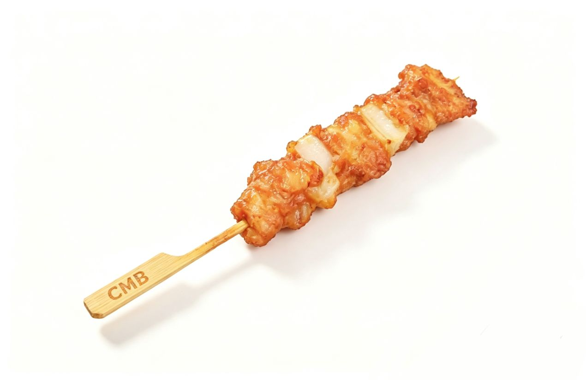

# CMB-skill：骨肉相连

> **Chicken Meat with Bone** — 一种面向 AI Agent 的结构化、可复现的多步骤工作流模式。



[English Version](README_EN.md)

---

## 理念

复杂任务的最大敌人是**不确定性的扩散**：每一步的模糊输出都会放大下一步的偏差，最终使整条链路难以调试、无法复现。

CMB 的答案是：用确定性的"骨"，将不确定性的"肉"串联起来。

- **Meat（肉）** 是推理与决策的过程——允许创造性，允许不确定
- **Bone（骨）** 是每步推理之后留下的结构化产物——必须确定，必须可读，必须可传递

链式结构如下：

```
Meat → Bone → Meat → Bone → ...
```

每块 Bone 是下一块 Meat 的唯一输入来源。这使得整条工作流可以在任意节点暂停、检视和恢复。

---

## 三条原则

**1. 歧义先行**
在执行任何步骤之前，先把所有影响决策的关键疑问摆到台面上，逐一确认。模糊的起点只会带来混乱的终点。

**2. 一步一事**
每块 Meat 只做一件事。分析是分析，设计是设计，实现是实现。拆得越细，每步越稳。

**3. Bone 即契约**
Bone 不是过程的副产品，而是步骤之间的正式约定。改变一块 Bone 的结构，就意味着下游所有依赖它的步骤都需要重新审视。

---

## License

[LICENSE](LICENSE)
